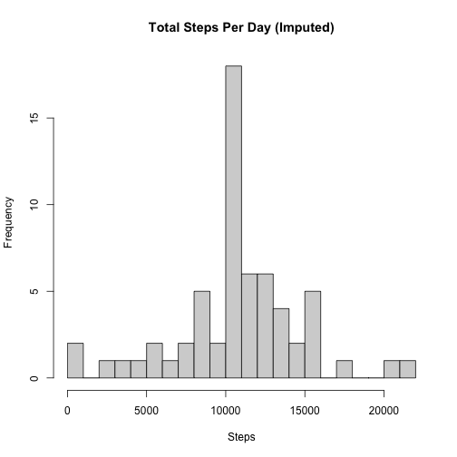

## Loading and preprocessing the data


``` r
activity <- read.csv("activity.csv", stringsAsFactors = FALSE)
activity$date <- as.Date(activity$date)
```

## What is mean total number of steps taken per day?

``` r
library(dplyr)
```

```
## 
## Attaching package: 'dplyr'
```

```
## The following objects are masked from 'package:stats':
## 
##     filter, lag
```

```
## The following objects are masked from 'package:base':
## 
##     intersect, setdiff, setequal, union
```

``` r
steps_per_day <- activity %>%
group_by(date) %>%
summarize(total_steps = sum(steps, na.rm = TRUE))

hist(steps_per_day$total_steps,
main = "Total Steps Per Day",
xlab = "Steps",
breaks = 20)
```


``` r
mean_steps <- mean(steps_per_day$total_steps)
median_steps <- median(steps_per_day$total_steps)

mean_steps
```

```
## [1] 9354.23
```

``` r
median_steps
```

```
## [1] 10395
```


## What is the average daily activity pattern?

``` r
avg_interval <- activity %>%
group_by(interval) %>%
summarize(avg_steps = mean(steps, na.rm = TRUE))

plot(avg_interval$interval, avg_interval$avg_steps, type = "l",
main = "Average Steps per 5-Min Interval",
xlab = "Interval",
ylab = "Average Steps")
```


``` r
avg_interval[which.max(avg_interval$avg_steps), ]
```

```
## # A tibble: 1 × 2
##   interval avg_steps
##      <int>     <dbl>
## 1      835      206.
```


## Inputing missing values

``` r
sum(is.na(activity$steps))
```

```
## [1] 2304
```

``` r
interval_means <- avg_interval$avg_steps
names(interval_means) <- avg_interval$interval

activity_imputed <- activity
activity_imputed$steps <- ifelse(
is.na(activity_imputed$steps),
interval_means[as.character(activity_imputed$interval)],
activity_imputed$steps
)

steps_per_day_imputed <- activity_imputed %>%
group_by(date) %>%
summarize(total_steps = sum(steps))

hist(steps_per_day_imputed$total_steps,
main = "Total Steps Per Day (Imputed)",
xlab = "Steps",
breaks = 20)
```



``` r
mean_steps_imputed <- mean(steps_per_day_imputed$total_steps)
median_steps_imputed <- median(steps_per_day_imputed$total_steps)

mean_steps_imputed
```

```
## [1] 10766.19
```

``` r
median_steps_imputed
```

```
## [1] 10766.19
```


## Are there differences in activity patterns between weekdays and weekends?

``` r
activity_imputed$day_type <- ifelse(
weekdays(activity_imputed$date) %in% c("Saturday", "Sunday"),
"weekend",
"weekday"
)

activity_imputed$day_type <- factor(activity_imputed$day_type)

avg_by_day <- activity_imputed %>%
group_by(interval, day_type) %>%
summarize(avg_steps = mean(steps))
```

```
## `summarise()` has grouped output by 'interval'.
## You can override using the `.groups` argument.
```

``` r
library(ggplot2)
ggplot(avg_by_day, aes(interval, avg_steps)) +
geom_line() +
facet_wrap(~ day_type, nrow = 2) +
labs(title = "Average Steps per Interval: Weekday vs Weekend",
x = "Interval",
y = "Average Steps")
```


